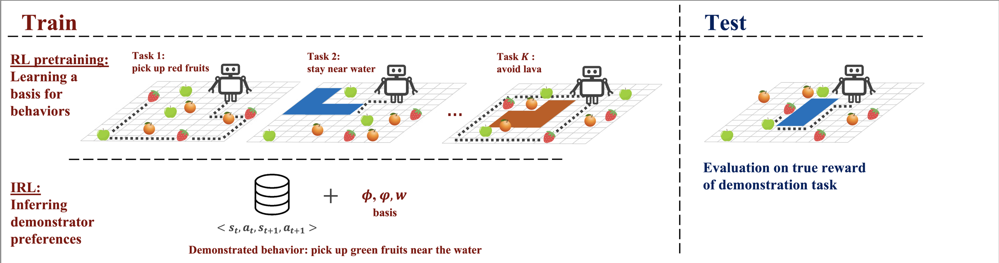

# BASIS: Behavior Acquisition through Successor-feature Intention inference from Samples
 
Official source code from the paper "Basis for Intentions: Efficient Inverse Reinforcement Learning using Past Experience"
 
[project site](https://sites.google.com/view/basis-site) | [arxiv]()
 

 
# Setup
This repo was designed for python 3.7.9. Dependencies are listed in `requirements.txt`
 
# Running Experiments
 
`agents/` contains all experiment scripts, including RL pre-training (Learning a Basis for Intentions) in `agents/pretraining_forward.py` and Inferring Intentions with IRL in `agents/irl.py`
We include all default hyperparameters in `config/default.yaml`, with domain-specific configs in `config/domain` and mode-specific configs in `config/mode`. By default all training scripts log to wandb online. To turn this off, set `WANDB_MODE` to `offline` in `misc/utils.py`
 
### **Recommended Experiment Workflow:**

For all experiments, you will run:
``` shell
./_train.sh
```
To specify the mode and domain, index into the appropriate parameter in `main.py`
We recommend the following workflow for training a BASIS agent:
1. Train a pre-trained by setting mode to `multitask-forward` and training until the reward converges on wandb.
2. Train the expert agent with preferences I would like the BASIS agent to infer (randomly generated) by setting mode to `expert`, similarly training till convergence.
3. After learning the expert policy, collect the expert trajectories by setting mode to `play-expert` and set the `config.demonstrations` parameter in the appropriate domain config file. 
4. Set mode to `irl` and run the IRL phase to see the performance of the basis agent inferring the experts preferences.

If you would like to run the ablation of multi-task IRL pre-training:
1. Collect expert trajectories for all tasks by setting mode to  `play-multitask-forward`, setting `traj_task_id` in `config/mode/play-multitask-forward.yaml` to the series of task indices (i.e. 0,1,2 for 3 tasks). 
2. Train a pre-trained by setting mode to `multitask-irl` and training until the reward converges on wandb.
3. Resume from step #2 in the previous set of instructions. 

# Repo Overview
 
* All models from each mode will be saved and loaded automatically. 
* `agents/` contains all scripts for each agent type. 
* `config` contain all the configs with default, domain, and mode-specific parameters 
* `envs` contain all environment files for Fruitgrid, Highway, and Roundabout Domains used in the paper. 
* `misc` contains utils
* `networks/` contains model files (for both simple and image features.)


 
